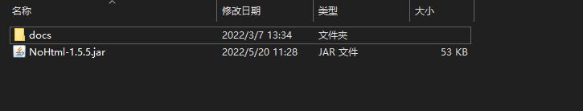

# NoHTML

`NoHTML`是一个用于整理`Markdown`文件的工具。
与`Jekyll`等网页生成工具不同，尽管`NoHTML`生成的文件可以导航，但`NoHTML`的主要目标是作为`Markdown`文件的整理工具。

## 一些问题

我为什么要写`NoHTML`？  
我不喜欢通过HTML的方式书写资料或是文档，富文本也不行，只有Markdown才是真爱。

`NoHTML`可以做什么？  
我不知道，反正我目前是把这个用于做个人资料整理。然后放到GitHub仓库中，用readme做首页，就可以当做一个资料库。  
这个 [records](https://github.com/Verlif/records) 就是我自己用NoHTML生成的。

`NoHTML`不可以做什么？

* 不能生成网站相关数据
* 不可以设定主题
* 没有拓展插件
* 高度定制需要Java基础

为什么是`NoHTML`？

* 简单。不需要任何编程知识，不需要安装，下载后直接运行即可。
* 轻量。只会生成配置文件与导航`markdown`文件。
* 纯净。对原`markdown`文件零修改。
* 统一。完全基于`markdown`使用逻辑，没有`HTML`文件。

## 使用

可以直接下载release的jar包，也可以将此项目pull下来，进行自定义修改。

1. 创建管理根目录（例如MyPage)
2. 将jar包放在管理根目录中（MyPage/NoHTML.jar)
3. 在管理根目录下创建docs文件夹用于放置需要管理的MD文件（MyPage/docs)
4. 运行jar包（例如`java -jar NoHTML.jar`)
5. 完成

其实就是下面这张图的样子。程序会读取docs下的文件来生成管理结构。



每次使用只需要运行jar文件，其他文件会自行更新。

## 说明

直属`docs`文件夹的MD文件属于`未归档`文件，可以在首页的未归档中找到。  
用到的本地图片建议放在`docs`文件夹下，例如在`docs\dayliy\images`存放`daily`的图片，方便自动备份。
在`docs`文件夹下的子文件夹中的所有MD文件都属于`标签归档`文档，可以在首页的标签归档中找到。  
__注意：在使用多端同步时，文件的创建日期会被修改，这回导致标签页面中的日期出现错误，所以请只在一端进行提交与更新操作__  
__注意：在使用多端同步时，文件的创建日期会被修改，这回导致标签页面中的日期出现错误，所以请只在一端进行提交与更新操作__  
__注意：在使用多端同步时，文件的创建日期会被修改，这回导致标签页面中的日期出现错误，所以请只在一端进行提交与更新操作__

## 配置文件

### config.properties

总配置文件，用于设定参数。  
请尽量不要使用Windows的文本编辑器来编辑，因为这个软件编辑后，会在文本的前面加上一个特有的标记，

```properties
# 档案标题
title=Verlif & Idea
# 首页的最新更新文件显示数量
size=5
# 文件概览的最长显示字数
length=25
# 首页文件名（支持通过英文“,”创建多个文件，第一个会作为主页面）
indexName=readme.md, index.md
# 标题分隔符
titleSplit=○
# 是否开启备份
enableBackup=true
# 备份文件数量上限（当开启备份时生效，数量到达上限时，会优先删除旧的备份）
backupMax=10
```

------

### config/profile.md

首页概述md文件，里面的内容会被复制到生成的首页中。
位置在标题与最新更新文件列表中间。

------

### config/footer.md

首页结语md文件，里面的内容会被复制到生成的首页中。
位置在标题列表后面。

## 目录结构

档案管理器需要一个管理器的目录，用户的所有需要管理的档案需要放置在其下的`docs`文件夹中

| 名称                | 文件类型 | 文件说明    | 是否手动创建 |
|-------------------|------|---------|--------|
| index.md          | 文件   | 首页档案    | 否      |
| docs              | 文件夹  | 档案根目录   | 是      |
| config.properties | 文件   | 配置文件    | 否      |
| config            | 文件夹  | 配置文件附录  | 否      |
| tags              | 文件夹  | 标签档案文件夹 | 否      |